# 3D Printed 35mm Film Camera

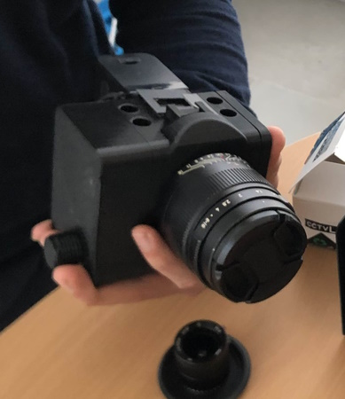

This repository documents the build of a 3D printed film camera that is designed to use standard 35mm 36exp film cartridges. With the goal of shooting small clips on a budget. By **[Valdir Neves](https://www.instagram.com/val.nevs/)** & **[Charlie Chaves](https://www.instagram.com/charliechavess/)**.

[{{{ **View in 3D on onshape** }}}](https://cad.onshape.com/documents/5c2b9c47264034ac5c1a5ddc/w/cf712b211e6f3dfb560adac5/e/ec23c9e4d3ee5216bc6ef26c?renderMode=0&uiState=696ad2c3b048071179547c61)

## Acknowledgements

Thanks to **[Hans Boden](https://github.com/hans-boden)** for guidance and support throughout this project, including lending a 3D printer.

Thanks to [MILL - Makers In Little Lisbon](https://www.instagram.com/lxmill/) for providing a platform for connecting with other makers.

Thanks to [Elly T.](https://www.instagram.com/forfutureelly/) for design advice.

## Inspiration

- Joshua Bird https://joshuabird.com/blog/post/3d-printed-film-video-camera
	[](https://github.com/jyjblrd/3D-Printed-Film-Video-Camera)
- Blaž Semprimožnik https://blazsemprimoznik.com/okto35-mk3
	[](https://www.youtube.com/@BlazSemprimoznik)
	[](https://www.instagram.com/blazsemprimoznik/)
- henry kidman
	[](https://www.youtube.com/watch?v=ZAtYJYfV2nA)
	[](https://www.youtube.com/@henry_kidman)
	[](https://www.instagram.com/henry_kidman/)


## Features

You can choose the gate size, and you can slide the whole internal core assembly (that holds the film) to allow for multiple passes. Use a small gate, film for a few seconds, rewind at the end, and shift. (kind of like a sideways typewriter with 4 lines max).

- Pulls 35mm film from the end, ignoring perfs.
- Interchangeable gate + Records multiple tracks in a single film strip (2 to 4). With the smallest gate you can film up to 50s @ 24fps* or 66s @ 18fps*, per cartridge. *(Not capable of recording videos yet.)*
- Independent variable shutter.
- Sony E mount for interchangeable lenses (18mm flange). Compatible with C-mount adapters. 
- Manual variable framerate (real time by logging time)
- OLED screen tracks how much film you used.
- Unique manual variable FPS feature designed to [save on film] or [add slow motion] mid-shoot. (Each frame will be logged in time making it easy to sync frames and sound).

## Code
[Wokwi](https://wokwi.com/projects/452815686144819201)

## Setup

- Onshape CAD software on Chrome
- UltiMaker Cura 5.11.0 Slicer
- Anycubic i3 Mega S Printer / 0.4mm nozzle / SMARTFIL 1.75mm Black PLA

## Parts

- 1x Nema 8 Stepper Motor for the shutter
- 1x Nema 14 Stepper Motor to pull film
- 2x Stepper Driver DRV8825 [[mauser.pt/096-8200]](https://mauser.pt/096-8200/controlador-de-motor-stepper-drv8825-p-impressora-3d-ou-cnc)
- 2x Tripod threaded insert (1/4") length 6mm 1.96€ 10pcs
- 8x 5x3mm round magnets 3.40€ 50pc

- Lens mount adaptor C-NEX (to support C-mount lenses) 2.74€
- Lens: 3.6-10mm f/1.4 C-Mount [1/1.8" when dividing film into 3+ strips] "8MP IR CCTV"

- Viewfinder: acrylic lens 24.8mm diameter 2.28€
- Viewfinder: front surface mirror 30x30x2mm 1.66€
- Viewfinder: plastic Fresnel lens f=28mm 30x30mm 2.92€

## History
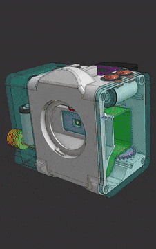

v20b
```
- shave off parts of gate and oled lid
- added 
- removed NPF wiring ducts
- fix shutter piece
```
v20a
```
- added support for roller on core
```
v20
```
- FDM focused redesign
- better gears
- add 4 magnets on each wall
```

v19
```
v19a: added switches
```


v18
```
- Not symmetric
- Custom buttons
```

v17

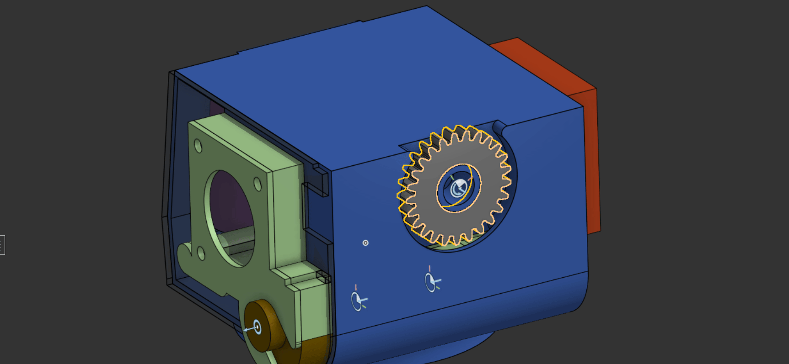

```
- Gear to move core
- 2x RCR123A
- OLED
```

v16
```
- Protuding shutter design thing
```

v15
```
- Fixed wrong flange value!
- Core completely encased to prevent light leaks
- Core on bottom
- Nema 8 for film
- Nema 14 for shutter
- Cold Shoe
```

v14
```
- Nema 8 for film
- 0530 6V Solenoid for shutter
- 2x RCR123A
```

v13
```
- Tests with solenoid for shutter and shifted reel motor
```

v12 - PRINTED @JLC3DP 

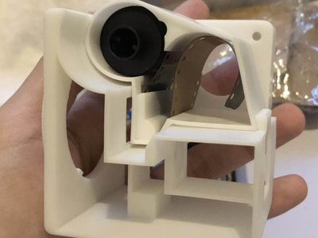
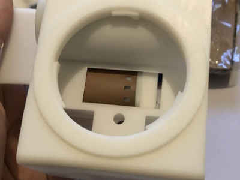
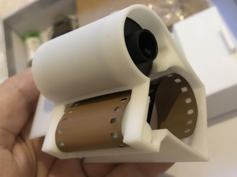
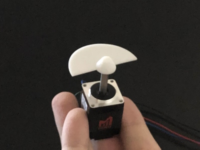
```
- Wrong flange value!
- Nema 14 for film 
- Nema 8 for shutter
- 71x72x67mm
- 2x RCR123A batteries and holder https://www.takachi-enclosure.com/assets/attachments/images/CR123A-PC.pdf
```


v11
```
- 4x RCR123A batteries
```

v10
```
?
```

v9


```
- Uses separate motors for each function instead of complex gears. One motor spins the shutter disc, another advances the film.
- Nema 17 for film and shutter
- 4x AAAA batteries
```

# Film scanner
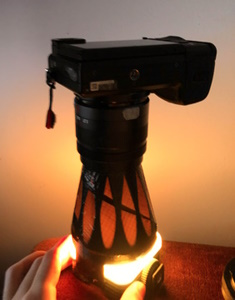

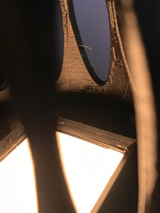

to photo scam 35mm 8 perforations film
using 7artisans 35mm f/.95 and a small video light

- v3 printed but film gets jammed
- v4 TBA

# etc

```
38exp = 1444mm
100ft = 30480mm
24.9 width
16:9 ratio
0.05 gaps between
@ 24 fps
```

```
@ 2 columns (12.42x6.989) (86.8mm²) (7.039mm pitch)
 38 exp: 17 sec
 100 ft: 6    min
 400 ft: 24   min
1000 ft: 60.1 min
```

```
@ 3 columns (8.26x4.65) (38.4mm²) (4.700mm pitch)
- ` 38 exp`: 38.4 sec
- ` 100 ft`: 13.5  min
- ` 400 ft`: 54    min
- `1000 ft`: 135.1 min
```

```
@ 4 columns (6.187x3.48) (21.5mm²) (3.530mm pitch)
-  38 exp: 68.1 sec
-  100 ft: 23.98 min
-  400 ft: 95.92 min
- 1000 ft: 239.8 min
```

```
- Super 16 @ 16:9 crop = 88.22 mm²
- 16mm     @ 16:9 crop = 59.24 mm²
- Super 8  @ 16:9 crop = 18.87 mm²
- 8mm      @ 16:9 crop = 11.39 mm²
```

# etc
Tripod threaded insert (1/4") length 6mm

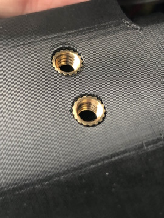

100ft of film makes 20 "36exp" cartridges

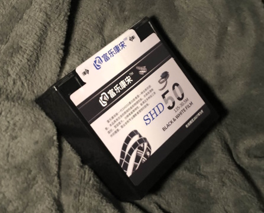

6.3-10mm f/1.4 C-mount lens

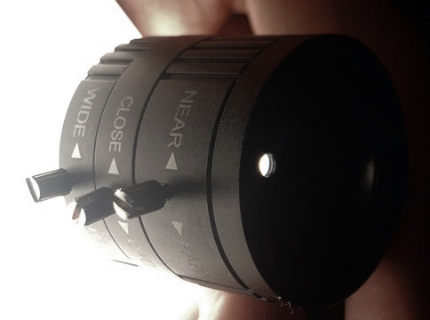
